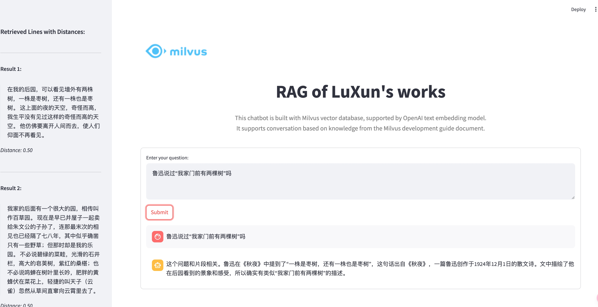

# RAG with LuXun's work and Milvus

## Prepare
Install dependencies
```shell
pip install -r requirements.txt
```

Insert data
```shell
python insert.py
```
This will generate a `milvus.db` file in the current directory.

## Run
```shell
streamlit run app.py
```

## Build with Docker
Build images
```shell
docker build -t luxuns_works .
```
Run container
```shell
docker run -p 5006:5006 luxuns_works
```
Visit http://localhost/luxuns_works:5006

### 部署到国内网络
参见 [export_model](export_model.md)